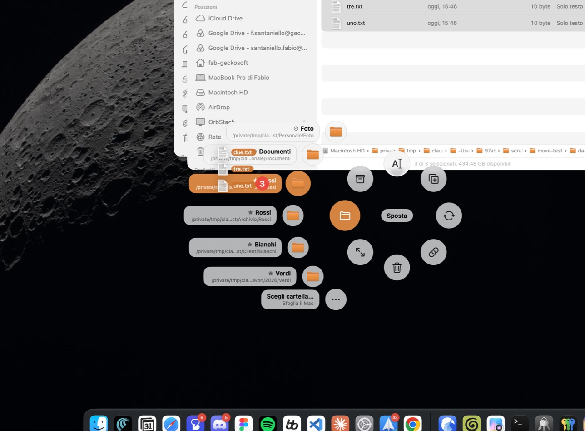
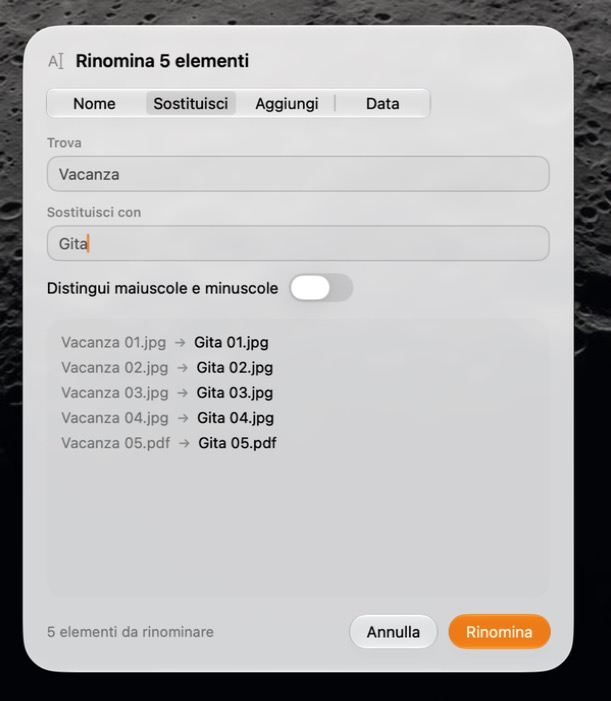
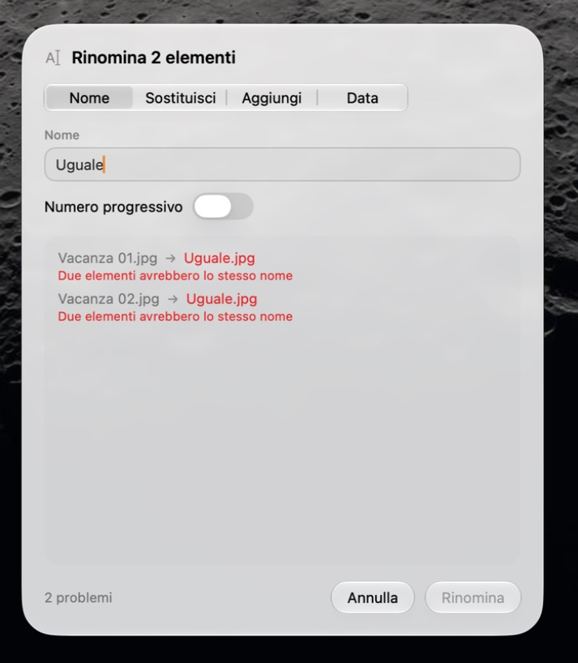

# Radial

**Drag files, hold a key, drop them on a ring of actions.**

Radial is a small macOS menu bar app. Start dragging files in the Finder, hold **⇧** (or any key
you choose), and a ring of glass buttons appears around your pointer. Drop the files on a button:
rename them in bulk, clone them, move them to a recent folder, convert or resize images, turn videos
into GIFs, compress, copy their
paths or send them to the Trash. Every action can be undone.

<p align="center">
  
</p>

> **Status:** beta (0.1). The interface is currently in **Italian**; an English localization is planned.

## Features

- **Bulk rename** with a live preview: name + counter, find & replace, add text, insert a date.
  Conflicts (empty names, duplicates, names already taken) are caught before anything is touched.
  Swaps and shifts like `1→2, 2→3` are handled safely.
- **Move** to the last two folders you used, your four favorites or any folder. Every entry shows the
  folder name and, in small type, its **full path**, so folders with the same name are never confused.
- **Convert images** to PNG, JPEG, HEIC, AVIF or TIFF, keeping metadata and orientation, and **SVGs to
  PNG** at 1x, 2x, 3x or 4x, or all four at once (`logo.png`, `logo@2x.png`…).
- **Resize images**: fit them in a width and height (a whole batch of landscape and portrait photos
  at once), scale by a percentage, or crop to 1:1, 4:3, 16:9 or any ratio. Choose the format and
  quality, or a maximum file size, with a live preview of dimensions and estimated weight.
- **Video → GIF** with a live, animated preview: pick the range on a filmstrip, speed, size and
  aspect ratio, frame rate, number of colors, dithering, looping and a maximum file size. Radial has
  its own GIF encoder (no ffmpeg): one palette for the whole clip, smooth dithering, and only the
  pixels that change are stored from frame to frame.
- **Clone**, **compress** (zip), **copy path** and **move to Trash** (Finder's *Put Back* keeps working).
- **Undo** for a few seconds after each action that changes files. Radial never overwrites a file:
  if a name is taken, the new file arrives as `name 2`.
- **Your key**: ⇧ by default; choose any modifier combination or key in Settings.
- Designed for macOS 26 **Liquid Glass**, follows light/dark mode and respects *Reduce Motion*.

<p align="center">
  
  &nbsp;&nbsp;
  
</p>

## Requirements

- macOS 26 (Tahoe) or later
- Apple silicon or Intel (universal binary)

## Install

1. Download `Radial.dmg` from the [latest release](https://github.com/fabiosantaniellobruun/radial/releases/latest).
2. Open it and drag **Radial** into **Applications**.
3. Launch Radial. It lives in the menu bar (there is no Dock icon), and a short welcome window explains how to use it.

### The first launch

Radial is free and open source, and it is not signed with a paid Apple Developer ID, so macOS cannot
verify it and blocks it the first time. You only need to allow it once:

1. Open Radial. macOS says it was not opened because Apple could not verify it: click **Done**.
2. Open **System Settings → Privacy & Security** and scroll down to *Security*: next to "Radial was
   blocked", click **Open Anyway**, then confirm with your password or Touch ID.

Or, in Terminal, remove the quarantine flag that the browser added to the download:

```bash
xattr -dr com.apple.quarantine /Applications/Radial.app
```

If you would rather not trust a download, the code is all here: you can read it and
[build it yourself](#build-from-source).

To uninstall, quit Radial from the menu bar and drag it to the Trash. Its preferences can be removed
with `defaults delete it.fabiosbruun.Radial`.

## Use

1. **Drag** one or more files in the Finder (or from the Desktop). Keep the mouse button down.
2. **Hold ⇧** (or your own key). A ring of buttons appears around the pointer.
3. **Move toward an action** and release the files on it. You only need to head in its direction: the
   button under the pointer lights up.

Some buttons open a **second ring**: hover **Move** and you get your recent and favorite folders;
hover **Convert to** and you get the formats (and **GIF**, when you are dragging a video). **Rename**, **Resize** and **GIF** open a panel with a preview,
which you can drag around by any empty spot.

To **cancel**, release the key or drag away from the ring: the drag carries on as usual.

### Settings

Open them from the menu bar icon (**⌘,**).

- **Trigger key**: click the field and press the combination you want. Modifier-only combinations
  (⇧, ⌥⇧, ⌃⌥…) are the safest choice: a regular key (Space, for example) also reaches the app you are
  dragging from. ⌫ restores ⇧, Esc cancels.
- **Keep the menu open** after releasing the key.
- **Open at login.**
- **Favorite folders** for *Move*: up to four, chosen with a button or by dropping a folder on a row.

## Privacy

Radial asks for **no permissions**, uses **no network** and sends **no data anywhere**. It notices that
a drag is in progress by watching mouse events and the drag pasteboard. It looks at the dragged files
when the ring opens (only their type, to offer GIF for videos) and when you drop them on an action.
System log messages that could contain file names are marked private.

## Build from source

You need Xcode 27 or later (macOS 26 SDK).

```bash
git clone https://github.com/fabiosantaniellobruun/radial.git
cd radial
xcodebuild -project Radial.xcodeproj -scheme Radial -configuration Release -derivedDataPath build build
open build/Build/Products/Release/Radial.app
```

Run the tests (they work on temporary folders):

```bash
xcodebuild test -project Radial.xcodeproj -scheme Radial -derivedDataPath build -destination 'platform=macOS'
```

To build a distributable DMG, see [docs/RELEASING.md](docs/RELEASING.md).

### Project layout

| Folder | What is in it |
|---|---|
| `Radial/Actions` | File operations (move, rename, convert, trash…) and their undo |
| `Radial/Input` | Drag detection and the configurable trigger key |
| `Radial/Menu` | Ring geometry, buttons, second-ring options |
| `Radial/Overlay` | The transparent panels and the controller |
| `Radial/Rename`, `Resize`, `GIF` | The bulk-rename, resize and video-to-GIF panels, their logic and the GIF encoder |
| `Radial/Settings`, `Toast`, `Welcome` | Settings window, result notice with Undo, first-run window |
| `RadialTests` | [Swift Testing](https://developer.apple.com/xcode/swift-testing/) suites |
| `docs` | [Design notes](docs/PROGETTO.md) (in Italian) and the [release guide](docs/RELEASING.md) |

## Contributing

Issues and pull requests are welcome. Please keep the tests passing and add some for new behavior;
the file operations in particular should never overwrite or lose anything.

## Credits

The app icon is made from a photo by [Sean Sinclair](https://unsplash.com/it/@seanwsinclair?utm_source=unsplash&utm_medium=referral&utm_content=creditCopyText) on [Unsplash](https://unsplash.com/it/foto/unimmagine-sfocata-di-uno-sfondo-color-arcobaleno-C_NJKfnTR5A?utm_source=unsplash&utm_medium=referral&utm_content=creditCopyText).

## License

[MIT](LICENSE) © 2026 Fabio Santaniello Bruun
